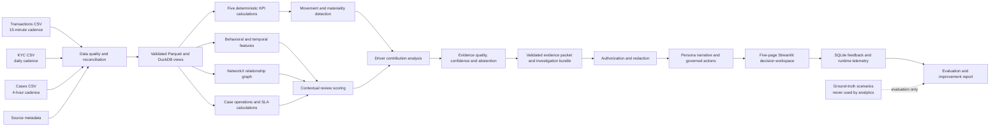

# SilentSignal — Final 7-Day Prototype Execution Plan

## 1. Final Product Decision

Do not restart the repository and do not turn SilentSignal into a general fraud-detection product.

The project already has a validated specification, governed configuration, schemas, tests, and a Streamlit scaffold. Start from that Milestone 1 foundation and build one complete decision journey:

> A bank compliance leader sees a material KPI movement, understands the ranked drivers, opens the connected activity behind it, checks the evidence and uncertainty, and takes a role-permitted action. A regional investigator sees more detailed but region-restricted evidence. Weak or contradictory evidence causes the system to abstain.

This is the winning differentiator:

`KPI movement -> contextual explanation -> connected pattern -> evidence confidence -> persona narrative -> governed action -> feedback and measurement`

SilentSignal is not:

- a generic dashboard;
- a chatbot placed beside charts;
- a single-transaction fraud classifier;
- an autonomous compliance decision-maker;
- a production banking platform.

---

## 2. What InsightAI Adds to Our Thinking

InsightAI's public material describes a financial-crime platform combining graph intelligence, behavioral signals, entity linking, contextual alert prioritization, AI-assisted case summaries, next-best actions, RBAC, auditability, and modular deployment. Its documentation also describes device-to-user graph mapping and live signal delivery.

Useful product lessons for SilentSignal:

1. **Context is more valuable than another alert.** A KPI or transaction by itself is weak; relationships, timing, customer context, and data quality make it useful.
2. **The graph must support an investigation.** It should connect accounts, identifiers, beneficiaries, branches, transactions, and cases—not exist as a decorative network chart.
3. **Prioritize with contextual risk.** Combine business impact, unusualness, persistence, connectedness, and evidence quality instead of relying on one static threshold.
4. **Make one investigation bundle.** Give the investigator the pattern, timeline, evidence, missing data, alternative explanation, and next action in one place.
5. **Measure operational outcomes.** Show false-positive reduction, time saved, cases consolidated, and SLA risk—not only a model score.
6. **Design security and auditability into the workflow.** Authorization must occur before restricted evidence retrieval or LLM use.
7. **Use AI to reduce investigation effort.** The LLM should summarize grounded evidence; it should not calculate the evidence.

Important limitation: InsightAI's public pages provide product descriptions and company-reported performance claims, not its complete internal architecture. Treat architectural conclusions here as informed design inferences. Do not reuse InsightAI's reported percentages as SilentSignal results; calculate our own evaluation metrics.

Sources:

- [InsightAI home page](https://insightai.in/)
- [InsightAI solutions](https://www.insightai.in/solutions/)
- [InsightAI Device Intelligence overview](https://docs-insightsecure-ai.mintlify.app/device-intelligence/overview)

---

## 3. Architecture Improvements to Add

The original architecture is directionally correct. Add these explicit components so the prototype feels like a decision system rather than separate analytics pages.

### 3.1 Behavioral and temporal feature layer

Derive transparent features from the existing synthetic data:

- near-threshold transaction count and value;
- transaction velocity by account and time window;
- repeated activity across days;
- number of distinct branches used;
- branch-hopping within a short period;
- account age at transaction time;
- shared phone/address hashes;
- shared beneficiary hashes;
- expected-turnover deviation;
- KYC age and missing-mapping flags.

Do not add device fingerprinting or document-forgery models during the seven-day build. They are useful production directions but would distract from the KPI intelligence objective.

### 3.2 Contextual priority score

Create a transparent `priority_score` for ordering movements or clusters. Keep it separate from `evidence_confidence`.

Suggested components:

- business impact;
- statistical unusualness;
- connected-pattern strength;
- persistence;
- operational urgency such as SLA risk.

The score is a review priority, never a probability of criminal activity. Show each component in the UI.

### 3.3 Investigation bundle

Create one typed object for the selected movement/cluster containing:

- movement summary;
- affected KPI and period;
- ranked drivers and contributions;
- cluster/entity summary;
- transaction timeline;
- source freshness and lineage;
- supporting and contradicting evidence;
- alternative hypotheses;
- missing information;
- evidence confidence and abstention reason;
- permitted actions;
- persona-specific narrative;
- trace and telemetry identifiers.

This becomes the single interface used by the investigation, action, and narrative pages.

### 3.4 Evidence packet as the system contract

All numbers and claims should enter the narrative/UI through a validated evidence packet. Give every fact an `evidence_id`, source, analytical method, timestamp, and value. This enables traceability and prevents an LLM from inventing a number.

### 3.5 Baseline comparator

Evaluate two approaches on the same predefined synthetic acceptance scenarios:

- **Baseline:** single near-threshold transaction rule.
- **SilentSignal:** KPI materiality plus graph/behavior context, evidence quality, and abstention.

Show precision, recall, F1, false positives, and the number of alerts requiring review. This is more credible than claiming that the system is simply “better.”

### 3.6 Explicit learning loop

Capture structured feedback rather than free text alone:

- useful/not useful;
- driver correct/incorrect;
- false positive/valid risk signal/needs more data;
- action accepted/rejected;
- corrected primary driver;
- analyst note;
- user, role, timestamp, scenario, and model/rule version.

For the prototype, “learning” means generating feedback summaries and threshold/calibration recommendations. Do not automatically retrain or change rules during the demo.

### 3.7 End-to-end trace

Assign a `trace_id` to every generated insight. Record:

- source versions and freshness;
- deterministic methods used;
- execution time per stage;
- authorization/redaction result;
- LLM called or skipped;
- model name, tokens, cost estimate, cache status, and latency;
- fallback or abstention reason.

This directly satisfies the hackathon's explainability, cost, latency, and auditability expectations.

---

## 4. Final Technical Architecture



### Deterministic processing

Python, Pandas, DuckDB, NetworkX, rules, and statistics own:

- data validation and reconciliation;
- all five KPI values;
- baselines and movement detection;
- graph construction and features;
- priority/review scores;
- driver contributions;
- evidence confidence and abstention;
- allowed actions;
- evidence IDs and lineage;
- security decisions;
- evaluation metrics and telemetry arithmetic.

### LLM processing

The optional LLM only owns:

- rewriting a validated evidence packet for a persona;
- summarizing supported drivers and alternatives;
- explaining an already-approved action.

The LLM must never calculate KPI values, invent evidence, choose an unauthorized action, or receive raw account/customer identifiers. The deterministic Jinja2 narrative must work even when the API is disabled.

### Proposed module map

Keep modules small, but do not create microservices.

| File | Responsibility |
|---|---|
| `src/data_generator.py` | Reproducible synthetic sources and scenario injection |
| `src/data_quality.py` | Schema, duplicate, validity, matching, and freshness checks |
| `src/kpi_engine.py` | Five governed KPI calculations |
| `src/movement.py` | Historical/peer baselines, materiality, movement ranking |
| `src/features.py` | Behavioral, temporal, account-age, and quality features |
| `src/graph_engine.py` | Relationship graph, connected components, cluster evidence |
| `src/driver_analysis.py` | Ranked contributions, residual, alternative drivers |
| `src/confidence.py` | Evidence-quality score, confidence label, abstention gate |
| `src/evidence.py` | Evidence records, packets, and investigation bundles |
| `src/security.py` | Region/role authorization, masking, and redaction |
| `src/actions.py` | Playbook matching and role-permitted recommendations |
| `src/narrative.py` | Jinja fallback, optional LLM, structured validation |
| `src/telemetry.py` | SQLite feedback, security, runtime, and model-call events |
| `src/evaluation.py` | Ground-truth-only evaluation and baseline comparison |
| `src/pipeline.py` | Thin orchestration across the tested modules |

Scripts:

- `scripts/generate_data.py`
- `scripts/run_pipeline.py`
- `scripts/evaluate.py`

Do not put business calculations inside `pages/`.

---

## 5. Fixed Seven-Day Scope

### Must ship

- three synthetic sources with different grains/cadences;
- all five deterministic KPIs;
- multi-factor S1 movement;
- S2 legitimate alternative;
- S3 abstention;
- S4 sparse-history behavior;
- S5 access denial;
- graph-supported investigation;
- two persona narratives/actions;
- source freshness, methods, confidence, contribution, and lineage;
- explicit LLM versus non-LLM execution trace;
- structured feedback and telemetry;
- calculated predefined-scenario evaluation with explicit sample size;
- working deployed Streamlit demo and backup video/screenshots.

### Ship only if the must-have path is stable

- optional OpenAI narrative;
- caching of identical evidence packets;
- compact timeline animation;
- downloadable evidence report;
- extra filters and chart polish.

### Do not build in these seven days

- device SDK;
- document-forgery model;
- live bank/API integration;
- Kafka or streaming infrastructure;
- FastAPI or microservices;
- graph database or graph neural network;
- vector database/RAG platform;
- production authentication;
- automatic account restriction or regulatory filing;
- complex causal inference;
- mobile application.

---

## 6. Working Method for Every Day

Use the same loop for each module:

1. Write the input, output, edge cases, and acceptance test in plain language.
2. Ask Codex/another coding LLM to implement only that module and its tests.
3. Read the important code and compare it with the specification.
4. Run the narrow test immediately.
5. Inspect a small hand-verifiable output.
6. Commit only when the checkpoint works.
7. Update `docs/BUILD_STATUS.md` truthfully.

Your job is to own the product logic:

- decide what the user must learn on each screen;
- verify formulas with small examples;
- judge whether explanations make business sense;
- reject unsupported conclusions;
- rehearse the demo and judge questions.

Use AI for:

- boilerplate and typed schemas;
- pure calculation functions;
- unit tests and edge-case generation;
- Streamlit components;
- code review and debugging;
- documentation updates.

Do not ask an AI to “build the whole project.” Give it one module, the relevant spec files, required tests, and the exact expected output.

---

## 7. Day-by-Day Build Plan

## Day 1 — Synthetic Data, Ground Truth, and Data Quality

### Outcome

By the end of Day 1, the repository can reproducibly generate all three raw sources, source metadata, and five hidden ground-truth scenarios; invalid data is detected rather than silently accepted.

### Morning: setup and contracts (1.5 hours)

1. Run the current checkpoint:

   ```bash
   python scripts/validate_project.py
   python -m unittest discover -s tests -v
   python -m compileall -q app.py pages src scripts tests
   ```

2. Create a feature branch or checkpoint commit.
3. Re-read `DATA_SPEC.md`, `EXPECTED_RESULTS.md`, and configuration thresholds.
4. Fix one analytical as-of time and seed, for example seed `42` and a fixed UTC timestamp.
5. Write generator acceptance tests before implementation.

### Build (4 hours)

Create:

- `src/data_generator.py`
- `scripts/generate_data.py`
- `tests/test_data_generator.py`

Generate approximately:

- 90 days of history;
- 150–250 accounts;
- 8,000–15,000 transactions;
- 80–150 case-status events;
- the four regions and required channels;
- normal, seasonal, and injected connected activity.

Inject S1–S5 with stable scenario IDs. Write scenario labels only to `data/ground_truth/events.csv`. Analytics must not import or read that path.

### Data-quality layer (2 hours)

Create:

- `src/data_quality.py`
- `tests/test_data_quality.py`

Validate duplicates, amounts, regions, timestamps, account matching, KYC freshness, source row counts, and schema versions. Retain unmatched accounts with quality flags; quarantine unknown regions.

Write clean processed data to Parquet only after validation.

### End-of-day checks (1 hour)

- Running the generator twice with seed 42 produces identical data hashes.
- S1 contains eight related new accounts over fourteen days and four branches.
- S2 has expected turnover/fresh KYC and no cross-account link.
- S3 has stale/missing evidence.
- `NEW_DEPOSIT` has only fourteen days of history.
- Source metadata correctly represents different refresh cadences.
- Tests cover duplicates, non-positive amounts, future timestamps, and unknown regions.

### Human review

Open 20–30 generated rows and manually follow one S1 account through transactions and KYC. If you cannot explain the scenario without code, simplify the generator.

### Stop condition

Do not start KPI work until data generation is deterministic and scenario truth is separated from analytics.

---

## Day 2 — Five KPIs, Historical Baselines, and Material Movements

### Outcome

By the end of Day 2, all five KPI values are correct, traceable, and time-aware; material movements and the sparse-history exception are identified without the LLM.

### KPI engine (3 hours)

Create:

- `src/kpi_engine.py`
- `tests/test_kpi_engine.py`

Implement exact contract formulas:

1. near-threshold value ratio;
2. linked-pattern exposure interface initially accepting qualified transaction IDs;
3. high-risk cluster count interface initially accepting qualified clusters;
4. alert investigation yield using closed cases only;
5. case SLA risk within the configured future horizon.

Use tiny hand-built fixtures where the answer can be calculated on paper. Test zero denominators, duplicates, boundary timestamps, and open-case exclusion.

### Movement engine (3 hours)

Create:

- `src/movement.py`
- `tests/test_movement.py`

Implement:

- same-grain KPI history;
- robust median/MAD or same-weekday baseline;
- current value, expected value, absolute and percentage delta;
- business-impact measure;
- materiality gate;
- visible hard-rule override;
- ranked movement priority.

Never use future rows to calculate a historical baseline.

### Sparse-history path (1.5 hours)

For `NEW_DEPOSIT`:

- detect insufficient history;
- choose comparable peer channels/branches using explicit rules;
- label the output `peer_based`;
- cap confidence;
- abstain when peers are insufficient.

### End-of-day checks (1 hour)

- Every KPI matches paper calculations.
- S1 causes a material rise in at least the intended connected KPIs.
- S4 never receives a normal long-history baseline.
- Movement output includes method, window, impact, and source freshness references.

### Human review

Prepare a one-minute explanation for each KPI: what it means, how it is calculated, why it matters, and one limitation.

---

## Day 3 — Behavioral Features, Relationship Graph, and Contextual Priority

### Outcome

By the end of Day 3, S1 appears as one explainable connected pattern, S2 remains unconnected, transactions are never double-counted, and clusters receive a transparent review priority.

### Feature engineering (2 hours)

Create:

- `src/features.py`
- `tests/test_features.py`

Calculate the behavioral and temporal features listed in Section 3.1. Keep each feature deterministic, named, and documented.

### Relationship graph (3 hours)

Create:

- `src/graph_engine.py`
- `tests/test_graph_engine.py`

Recommended graph design:

- account nodes;
- optional identifier/beneficiary/branch nodes when they improve traceability;
- edges for shared phone, address, beneficiary, and meaningful temporal/branch relationships;
- edge attributes containing reason and supporting transaction IDs;
- NetworkX connected components for candidate clusters.

Render only a selected cluster or focused one-hop neighborhood in the UI later.

### Transparent review score (2 hours)

Score patterns with visible components such as:

- near-threshold intensity;
- repeated activity/persistence;
- shared-identifier strength;
- branch dispersion;
- new-account concentration;
- exposure value.

Keep score weights in configuration. Do not call the score a fraud probability.

### End-of-day checks (1 hour)

- S1's eight accounts form the intended connected component.
- S2 does not become part of S1.
- Every edge has a human-readable reason and evidence IDs.
- `linked_pattern_exposure` uses unique transaction IDs.
- High-risk cluster count is a distinct-cluster count.
- Reordering input rows does not change results.

### Human review

Draw the S1 graph on paper and compare it with the generated graph. Remove any edge that cannot be explained to a judge.

---

## Day 4 — Driver Contributions, Evidence Confidence, and Abstention

### Outcome

By the end of Day 4, each prioritized KPI movement has ranked quantitative drivers, an explicit residual, supporting/contradicting evidence, and a defensible confidence or abstention result.

### Contribution analysis (3 hours)

Create:

- `src/driver_analysis.py`
- `tests/test_driver_analysis.py`

Break the KPI delta down by configured dimensions such as region, branch, channel, business type, account-age band, and cluster. Use arithmetic contribution for additive values and a documented approximation for ratios. Show an unexplained residual and test reconciliation tolerance.

Do not describe a contribution as causal.

### Confidence and abstention (2.5 hours)

Create:

- `src/confidence.py`
- `tests/test_confidence.py`

Calculate evidence quality from visible components:

- source freshness;
- mapping completeness;
- history sufficiency;
- method agreement;
- contradictory/alternative evidence;
- supporting evidence coverage.

Critical missing/stale data can force abstention. Map the result to `high`, `medium`, `low`, or `abstain`, with machine-readable reason codes.

### Evidence layer (2 hours)

Create:

- `src/evidence.py`
- evidence/investigation Pydantic schemas in `src/schemas.py`;
- `tests/test_evidence.py`.

Build evidence packets with stable IDs, values, units, source lineage, methods, timestamps, freshness, contributions, limitations, alternatives, and permitted next-action inputs.

### End-of-day checks (1 hour)

- S1 with complete data has strong evidence.
- S2 includes a legitimate seasonal alternative and does not claim wrongdoing.
- S3 requests fresh KYC/entity mapping and abstains from escalation.
- S4 is explicitly peer-based with capped confidence.
- Contributions reconcile to the movement within tolerance.
- Every displayed quantitative claim can reference an evidence ID.

### Human review

Ask, “What evidence would prove this explanation wrong?” Add that as an alternative or limitation where appropriate.

---

## Day 5 — Security, Actions, Narratives, Feedback, and Telemetry

### Outcome

By the end of Day 5, users see only authorized information, receive different narratives/actions, the app works without an LLM, and every run records useful operational evidence.

### Authorization and masking first (1.5 hours)

Create:

- `src/security.py`
- `tests/test_security.py`

Authorization order:

1. resolve user and requested region;
2. reject unauthorized region/detail access;
3. record the denial;
4. only then fetch/build restricted evidence;
5. mask identifiers before narrative or UI use.

Prove S5 denies a WEST investigator requesting NORTH detail before evidence construction and before any LLM call.

### Governed actions (1 hour)

Create:

- `src/actions.py`
- `tests/test_actions.py`

Return only actions from `configs/action_playbooks.yaml` allowed for the current role. Structure each as:

`driver -> lever -> action -> expected-impact method -> owner -> confidence -> monitoring KPI/plan`

No account freeze or regulatory filing.

### Deterministic narrative first (1.5 hours)

Create:

- `src/narrative.py`
- Jinja2 templates for Compliance Head and Regional Investigator;
- `tests/test_narrative.py`.

The Compliance Head narrative should emphasize exposure, regional contribution, capacity, confidence, and management action. The Investigator narrative should emphasize masked entities, timing, evidence gaps, alternatives, and case steps.

### Optional LLM layer (1.5 hours maximum)

Only after the fallback works:

- send a redacted validated packet;
- request strict structured fields;
- validate all evidence IDs and numeric claims;
- bound retries;
- cache identical packet/persona combinations;
- fall back deterministically on error or validation failure.

If this is unstable after 90 minutes, disable it for the prototype and show the deterministic narrative plus the designed LLM boundary.

### Feedback and telemetry (2 hours)

Create:

- `src/telemetry.py`
- SQLite tables for runs, stages, model calls, feedback, actions, and security events;
- `tests/test_telemetry.py`.

Record trace ID, stage latency, method, model call/skip, token counts, estimated cost, cache result, fallback, abstention, persona, action, and structured feedback.

### End-of-day checks (0.5 hour)

- Two personas receive materially different narratives/actions.
- Unauthorized data never enters evidence or LLM context.
- No raw identifiers appear in narrative/log snapshots.
- LLM-disabled mode completes the full journey.
- Feedback and telemetry survive an application restart.

---

## Day 6 — End-to-End Pipeline and Five-Page Decision Workspace

### Outcome

By the end of Day 6, one person can complete the entire demo journey without opening a terminal, and all pages show calculated rather than hard-coded results.

### Pipeline orchestration (1.5 hours)

Create:

- `src/pipeline.py`
- `scripts/run_pipeline.py`
- `tests/test_pipeline.py`

The orchestrator should call existing tested modules; it must not duplicate their logic. Cache processed artifacts where safe.

### Page 1: KPI Pulse (1.5 hours)

Show:

- five KPI cards with current value/delta;
- prioritized movements;
- materiality and confidence;
- source-freshness badges;
- clear link to the selected explanation.

### Page 2: Why It Changed (1.5 hours)

Show:

- current versus expected;
- contribution waterfall;
- ranked drivers and residual;
- method, history window, and alternatives;
- evidence drawer.

### Page 3: SilentSignal Investigation (1.5 hours)

Show:

- focused relationship graph;
- cluster summary and review-score components;
- transaction timeline/table;
- masked entity evidence;
- supporting, contradicting, and missing evidence.

### Page 4: Actions (1 hour)

Show persona narrative, permitted action, owner, expected-impact basis, confidence, monitoring plan, and feedback controls. If abstaining, show the clarification/data request instead of an escalation.

### Page 5: Governance (1 hour)

Show:

- source freshness and lineage;
- analytical execution trace;
- deterministic versus LLM stages;
- latency, tokens, cost, calls, cache, and fallback;
- feedback summary;
- security denial event;
- current evaluation preview.

### End-of-day smoke test (1 hour)

Run the app as each persona. Test S1, S2/S3, S4, and S5. Check empty/error states, narrow browser widths, chart labels, INR formatting, loading time, and whether the next click is obvious.

### UI rule

Judges should understand the central story within 30 seconds. Use one strong graph and one strong waterfall; remove decorative charts.

---

## Day 7 — Evaluation, Deployment, Submission, and Demo Rehearsal

### Outcome

By the end of Day 7, the prototype is tested, deployed, measurable, backed up, and explainable in a short live demo.

### Held-out evaluation (2 hours)

Create:

- `src/evaluation.py`
- `scripts/evaluate.py`
- `tests/test_evaluation.py`
- generated `artifacts/evaluation.json` and/or Markdown summary.

Compare the single-rule baseline with SilentSignal on predefined synthetic scenarios. Calculate:

- precision;
- recall;
- F1;
- false-positive count/rate;
- false negatives;
- abstention coverage and correctness;
- average investigation items presented;
- pipeline and narrative latency.

Never type the final metric values manually.

### Golden scenario test (1 hour)

Create one integration test for each S1–S5 expected result. Confirm ground truth is read only inside evaluation code.

### Deployment (1.5 hours)

1. Push the tested repository to GitHub.
2. Deploy `app.py` on Streamlit Community Cloud.
3. Configure secrets outside Git.
4. Keep `llm.enabled: false` as the safe default unless the deployed API path is verified.
5. Test the public/private link in an incognito window.
6. Verify Linux-safe paths and requirements.

Official deployment guidance: [Streamlit Community Cloud deployment](https://docs.streamlit.io/deploy/streamlit-community-cloud/deploy-your-app/deploy).

### Demo assets (1.5 hours)

Prepare:

- 3–4 minute primary demo script;
- 60-second backup version;
- backup screen recording;
- five screenshots, one for each required scenario/proof;
- one architecture diagram;
- one LLM/non-LLM responsibility table;
- one evaluation comparison table;
- README setup and demo instructions.

### Rehearsal and judge questions (2 hours)

Rehearse these questions:

- Why is this BusinessIntelligence.ai rather than only AML detection?
- How do you know the KPI movement is material?
- How are drivers ranked, and do they reconcile?
- What happens when evidence is weak or contradictory?
- What does the LLM do, and what can it never do?
- How do you prevent data leakage and unauthorized access?
- How does the feedback loop learn?
- What is measured against a baseline?
- How would the prototype scale in production?

### Final release gate

Do not add features after the release candidate. Fix only correctness, security, crash, broken-flow, and serious presentation issues.

---

## 8. Daily Command and Commit Discipline

At the end of every day run:

```bash
python scripts/validate_project.py
python -m unittest discover -s tests -v
python -m compileall -q app.py pages src scripts tests
```

Also run the day's generator/pipeline/evaluation command and inspect its output.

Suggested checkpoint commits:

1. `feat: add deterministic synthetic scenarios and data quality`
2. `feat: calculate governed KPIs and material movements`
3. `feat: add behavioral graph and contextual priority`
4. `feat: add drivers evidence confidence and abstention`
5. `feat: add security narratives actions feedback and telemetry`
6. `feat: integrate decision workspace`
7. `test: add predefined-scenario evaluation and demo release`

Never weaken a test to make a checkpoint pass.

---

## 9. Exact Demo Story

Use this sequence during judging:

1. Log in as Compliance Head and show that `linked_pattern_exposure` is the top material movement.
2. Open Why It Changed and show that new accounts, connected branches, and near-threshold activity explain most of the movement; point to the residual and method.
3. Open the investigation and show one focused eight-account relationship pattern with evidence-backed edges and a timeline.
4. Show source freshness, supporting evidence, alternative explanations, and high confidence.
5. Switch to the North Investigator and show more detailed masked evidence plus the `consolidate_linked_events` action.
6. Open S3 and show the engine abstaining because KYC/mappings are insufficient, recommending a data refresh instead of escalation.
7. Trigger S5 and show the West Investigator being denied North detail before an LLM call.
8. Open Governance and show deterministic methods, optional LLM use, latency/tokens/cost, feedback, security event, and baseline evaluation.

Finish with:

> SilentSignal does not use an LLM to decide what is true. Deterministic analytics establish the movement, drivers, graph, confidence, and permissions; the LLM only communicates already-validated evidence to the right person.

---

## 10. If Work Falls Behind

Cut in this order:

1. animation and visual polish;
2. optional LLM call—retain deterministic narratives;
3. caching;
4. downloadable reports;
5. secondary chart/filter variants.

Never cut:

- correct KPI calculations;
- S1–S5 behavior;
- evidence traceability;
- abstention;
- role-based denial;
- baseline evaluation;
- full demo path.

If a day slips, preserve the vertical slice. A small system that proves every required behavior is stronger than a large system with disconnected, unreliable features.

---

## 11. Final Definition of Done

The seven-day prototype is complete only when:

- a fresh clone can be installed and run from the README;
- data generation is deterministic;
- all five KPIs pass hand-verifiable tests;
- S1–S5 pass integration tests;
- contributions reconcile and expose residual;
- confidence/abstention reasons are visible;
- two personas receive different authorized outputs;
- unauthorized evidence is rejected before LLM use;
- the app works without an LLM;
- feedback and telemetry persist;
- metrics are calculated on predefined scenarios and labelled as acceptance diagnostics;
- the five pages form one coherent decision journey;
- the deployed link and backup recording both work;
- `docs/BUILD_STATUS.md` and the README match reality.
